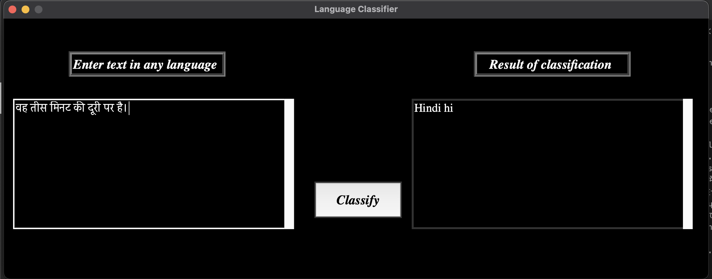

# Language Classifier App

## Contributors of this project

### By Joanne Gitari and Maureen Njihia on 9th December 2022 

## Description
Language Classifier App is an application built using Python3 using the LangDetect AI tool to detect languages from a given text and classify them.

## Setup Requirements

* Git
* Github
* Web Browser
* LangDetect tool
* Python 3.10

## Setup Installation

* Copy this repository's link 🌐
```
https://github.com/joeygitari/Language_Classifier-App.git
```
* Clone it to your local machine 💻
```
$ git clone https://github.com/joeygitari/Language_Classifier-App.git
```
* Open your terminal and navigate to the directory of the project 📁
```
$ cd Language_Classifier-App
```
* Run the following commands to install the required dependencies 
(use pip or pip3 depending on version)🗂
```
$ pip install langdetect
```
```
$ pip install tkinter 
```

## Technologies used
* Python 3.10.8
* Tkinter GUI

## Some Screenshots


## Known bugs
There are no known bugs at the moment. 💁🏾‍♀️

## Support and contact details

For any contributions contact:
* Emails : gitarijoanne@gmail.com / developer.njihia@gmail.com
* Phone : 0706804187 / 0704592362

# License 

Copyright (c) 2022 University of Nairobi

Permission is hereby granted, free of charge, to any person obtaining a copy of this software and associated documentation files (the "Software"), to deal in the Software without restriction, including without limitation the rights to use, copy, modify, merge, publish, distribute, sublicense, and/or sell copies of the Software, and to permit persons to whom the Software is furnished to do so, subject to the following conditions:

The above copyright notice and this permission notice shall be included in all copies or substantial portions of the Software.

THE SOFTWARE IS PROVIDED "AS IS", WITHOUT WARRANTY OF ANY KIND, EXPRESS OR IMPLIED, INCLUDING BUT NOT LIMITED TO THE WARRANTIES OF MERCHANTABILITY, FITNESS FOR A PARTICULAR PURPOSE AND NONINFRINGEMENT. IN NO EVENT SHALL THE AUTHORS OR COPYRIGHT HOLDERS BE LIABLE FOR ANY CLAIM, DAMAGES OR OTHER LIABILITY, WHETHER IN AN ACTION OF CONTRACT, TORT OR OTHERWISE, ARISING FROM, OUT OF OR IN CONNECTION WITH THE SOFTWARE OR THE USE OR OTHER DEALINGS IN THE SOFTWARE.
